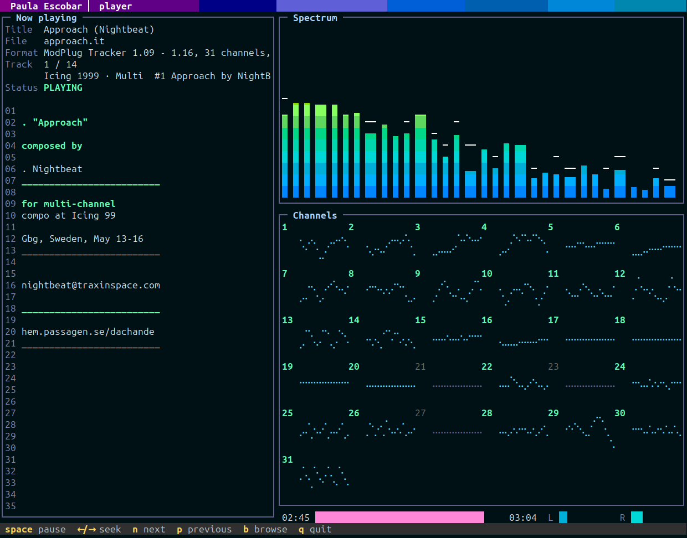

# Paula Escobar

A terminal music player for demoscene and chip music, named after the Amiga's
sound chip. Everything happens in the terminal: picocli drives the command
line and JLine draws a full-screen, colour player view. The build produces a
native executable with GraalVM, so there is no JVM to start and no jar to
carry around.

Paula Escobar plays local files, but it also opens the party archives: the music
competitions of over fifty party series — from The Party, Assembly and The
Gathering through Breakpoint and Revision to Swedish Icing, the Polish
classics Intel Outside, Gravity and Xenium, and X, the largest party the
Commodore 64 has to itself — can be browsed year by year straight from the
player, and any placed entry is downloaded from scene.org, ModArchive or
Modland and played on the spot.

Tracker modules are decoded and mixed by [JavaMod](https://github.com/quippy-git/javamod),
Daniel Becker's pure-Java player, which covers ProTracker, NoiseTracker,
FastTracker II, Scream Tracker, Impulse Tracker, Farandole and MultiTracker
files among others. Commodore 64 SID tunes play through the libsidplay2
port with reSID chip emulation that JavaMod bundles. Its jar is vendored
under `lib/` as a small Maven repository because no current release is
published to Maven Central. DigiBooster modules, which JavaMod does not
read, have a replayer of their own inside Paula Escobar. The recorded
formats a streaming music competition is handed in as play too: MPEG audio
frame by frame through the JLayer decoder in that same jar, FLAC through
jFLAC and Ogg Vorbis through jOrbis beside it, the Vorbis stream driven
straight off its pages rather than through JavaMod's own container, which
reaches for a window toolkit the native image has not got, and wave, AIFF
and AU files straight from the samples they carry. All of them are
resampled to the rate the engine mixes at, and `--rate 44100` hands a
CD-rate file through untouched.

## Building

```
mvn package
```

produces `target/paula`, a native executable. The build needs Maven and a
GraalVM for JDK 21 or newer registered in `~/.m2/toolchains.xml` with the
vendor `graalvm`, for example:

```xml
<toolchain>
    <type>jdk</type>
    <provides>
        <version>22</version>
        <vendor>graalvm</vendor>
    </provides>
    <configuration>
        <jdkHome>/home/you/graalvm/graalvm-jdk-22.0.2+9.1/</jdkHome>
    </configuration>
</toolchain>
```

A C compiler is needed as well (`cc` on Linux and macOS, Visual Studio's
`cl` on Windows); `native-image` itself already requires one. The sound
shim in `src/main/c` is compiled into a static library during
`prepare-package`, so `mvn test` runs without it.

Compilation, tests and `native-image` all run on that toolchain, so
`JAVA_HOME` and `GRAALVM_HOME` do not matter. `mvn test` runs the unit tests
without building the native image.

## Usage

```
paula                        browse the party archives
paula song.mod another.mod   play the files in order
paula info song.mod          print metadata
paula formats                list supported formats
paula --help
```

Keys while playing:

| Key     | Action                  |
|---------|-------------------------|
| `space` | pause / resume          |
| `←` `→` | seek five seconds       |
| `n`     | next track              |
| `p`     | previous track          |
| `b`     | switch to the browser   |
| `v`     | next visualiser         |
| `?`     | show the keys           |
| `q`     | quit                    |

The mouse works the panels. A click on the upper one turns it to the next
visualiser, as `v` does. Down among the scopes it silences channels: click
one to turn that channel off and click it again to bring it back, or
shift-click it to leave it alone sounding and shift-click it once more for
the rest. A double click does what a shift-click does, for the terminals
that keep shift-click to themselves for selecting text. A silenced channel
keeps its scope, flat and its number struck through, and is let back in the
moment it is asked for. What is silenced belongs to the track being played
and starts afresh with the next one.

Keys while browsing:

| Key                 | Action                                   |
|---------------------|------------------------------------------|
| `↑` `↓`             | move the cursor                          |
| `PgUp` `PgDn`       | move a page                              |
| `Home` `End`        | jump to the first or last line           |
| `enter` `→`         | open the line, or play an entry          |
| `backspace` `←` `esc` | go back one level (`esc` at the top quits) |
| `b`                 | switch to the player                     |
| `r`                 | fetch this list and its logo afresh      |
| `?`                 | show the keys                            |
| `space`             | pause / resume what is playing           |
| `q`                 | quit                                     |

### The screens



Both screens fill the terminal: a gradient title bar on top, the key hints
in a bar at the bottom and box-drawn panels in between, in 24-bit colour
where the terminal supports it and rounded to 256 or 16 colours where it
does not. The player shows the song details on the left, with the
instrument that is sounding lit up, and on the right a 32-band spectrum
analyser with peak hold, one braille-dot oscilloscope per channel (a
single one for SID tunes, which is nobody's to silence), a position bar
with elapsed and total time and stereo VU meters, all redrawn thirty times
a second. `v`, or a click on the upper panel, turns it over to the next of
three: the spectrum, a waterfall of where it has been with the newest
reading at the top, and a vectorscope plotting left against right, where
a mono mix stands upright, opposed channels lie flat, and the hard panned
channels of an Amiga module draw a shape of their own. The browser colours
the first three placings gold, silver and bronze, highlights the line the
cursor rests on, and shows what is playing with a small spectrum strip above
the key bar, so music keeps going while you browse. The shot above is
Approach by Nightbeat, which won the multichannel competition at Icing
1999, with a scope for each of its 31 channels and the message the musician
wrote into the sample names beside them.

### Browsing demo parties

`?` lays the keys of the screen you are on over it, the ones the bar at the
bottom has no room for among them, and any key puts them away again.

The browser starts with the party series listed by name, opens into the
parties by year, then into every music competition of that party and
finally into the ranked entries. The series and the parties are laid out
in columns across the width, so fifty-two series sit on one screen rather
than three; walking down runs to the foot of a column and on to the head
of the next. A competition says what it was run in and how many entries it
drew, a party the date it opened, and an entry keeps its title, its author
and whatever is the matter with it in columns of their own. Entries in executable music competitions are shown dimmed because
Paula cannot play them, but they stay in the list so the results are
complete. Streaming competitions are not dimmed, since MPEG audio, FLAC,
Ogg Vorbis and wave files all play. C64 competitions play through the SID
emulation.
Entries Demozoo has no download for are marked "(no download)" as soon as
their details have been fetched, since some releases never made it to any
archive. One whose only download is a container Paula has no reader for,
an Amiga disk image most often, is marked "(no reader)" the same way. A
competition run for a format nothing here can decode — the ReBirth songs
of Alternative Party 2007 are pages of knob settings for a synthesiser
rather than audio — is marked "(unsupported music format)" from the
moment it opens, since its name is the only word on it and nothing need
be fetched to know.
Playing an entry queues the rest of the competition
after it in ranked order, so `n` walks through the results.

Party data comes from [Demozoo](https://demozoo.org). The entry itself is
fetched from scene.org when Demozoo knows the party release there, otherwise
from ModArchive or Modland. Zip, 7z, RAR, LHA, Amiga LZX archives and 1541
disk images are unpacked, along with whatever archives they hold in turn, and
the file inside named after the entry is played, or the first module in
name order when none is. Modules wrapped by the
Amiga's XPK packer are unwrapped as well when they use the NUKE, DUKE or
SQSH packers, which is what tracker modules of the time were packed with.

A party archive can hold hundreds of entries, so unpacking one says so on
the status line, naming the archive and counting its way through rather
than sitting on "Loading", with a bar beneath it. A download long enough
to be waited on — half a megabyte or more, which a recorded track reaches
and a module rarely does — counts itself up the same way. The download
knows how much is coming so its bar fills; an archive only ever knows how
many entries it has got through, never how many are left, so that one
sweeps a block to and fro at the pace it is working rather than claiming
a share it cannot know.

Party archives are often packed with a `file_id.diz` or an information file
carrying a hand drawn banner for the competition. Art travels inside such
an archive, so a release handed in as a bare recording is left where it is
rather than brought down to be looked inside: a streaming competition is a
list of them, many megabytes apiece. Opening a competition
brings down its first entry in the background — the download playing it
would have cost anyway — and the art that comes with it is shown above the
list for every entry in that competition, an entry's own art taking
precedence. It is read in the code page it was drawn in: the box characters
of the PC or the accented letters of the Amiga, whichever the file leans
towards. Art shaped by terminal escapes is left alone.

Competitions handed in as bare modules carry no such file, and there the
party stands in for them. Demozoo names the folder a party keeps on
scene.org, and the file id or information file found in it — the information
directory first, since that is where a party keeps what belongs to the party
as a whole — is shown as the competition opens, until an entry's own art
takes its place. A ticker turns beside an entry whose files are on their way
down, and beside the competition while its logo is fetched, so a wait looks
like a wait rather than like nothing happening.

`r` fetches the list in view again: the answer Demozoo gave for it is thrown
away and asked for anew, and in a competition its party's logo goes with it,
so a list that has moved on since, or a logo that never arrived, can be had
without leaving the browser. Downloaded modules are kept, being the
expensive part.

Everything fetched is kept under `~/.cache/paula` (or `$XDG_CACHE_HOME/paula`
when that variable holds an absolute path): Demozoo answers are refreshed after a week but
still used when the network is down, and downloaded modules and party logos
are kept for good.
Delete the directory to start over.

### SID tunes

A SID tune never ends on its own, so Paula plays it for the length listed
in the High Voltage SID Collection's song length database. That database
(`Songlengths.md5`, about five megabytes) is downloaded into the cache the
first time a SID is played, refreshed monthly and kept when offline; tunes
it does not know play for three minutes. The start subtune is played and the
player shows the author and release credits from the file.

### DigiBooster modules

The modules of DigiBooster Pro 2 and DigiBooster 3, the Amiga trackers no
other Java player reads, are played by a replayer written for Paula: the
sequencer and effects of the tracker, envelopes per instrument, and a chain
of wavetable, resampler, stereo panoramizer and cross feeding echo for every
one of the up to 254 tracks. It follows
[libdigibooster3](https://github.com/grzegorz-kraszewski/libdigibooster3),
the reference replayer released by APC&TCP under the two-clause BSD licence,
and renders the modules on Modland sample for sample as that library does.

### Commodore 64 disk images

A party file for a C64 competition is often a 1541 disk image holding every
entry as a program rather than a tune. Those images are unpacked like any
other archive — they carry no header, so they are known by their size — and
the programs inside are run by the same emulation that plays SID files. A
program plays the whole release, so it is only reached for when no link
offers the tune itself.

### Audio output

The native executable plays sound itself through
[miniaudio](https://miniaud.io), which is compiled into it. It picks the
first backend that answers: WASAPI on Windows, CoreAudio on macOS,
PulseAudio (also PipeWire), ALSA and JACK on Linux. Pick one explicitly
with `--output pulse`, `--output alsa`, `--output jack`,
`--output coreaudio` or `--output wasapi`; `--output null` plays into
nothing at the right speed, which is what the build's own test run uses.
When Paula runs on a JVM, from the runnable jar or from the tests, Java
Sound is used instead (`--output javasound`).

Java Sound is not open to the native executable: a native image finds no
mixer providers, which [GraalVM does not intend to
fix](https://github.com/oracle/graal/issues/9620). That is why the
executable carries a sound library of its own.

`--quit-after SECONDS` stops Paula by itself after that long and lets it
run without a terminal, for scripts and for the build.

Log output goes to `paula.log` in the working directory so it never
disturbs the player screen.

### Sound on the machine you are sitting at

`tools/paula-sound` starts the player where it lives and plays it out of the
machine you have ssh'd in from. That machine opens the way itself: it serves
its sound on its own loopback,

```
pactl load-module module-native-protocol-tcp listen=127.0.0.1
```

and carries a reverse tunnel to it with the ssh connection, once and for all
in its `~/.ssh/config`:

```
Host <the machine running paula>
    RemoteForward 4713 127.0.0.1:4713
```

Nothing listens on the network at either end. The script points
`PULSE_SERVER` at the near end of the tunnel, which the PulseAudio backend
— the first one tried on Linux — picks up. Were nothing answering there,
the sound would fall through to ALSA on the machine running Paula, so the
script makes sure a sound server replies before it starts anything. When a
piece is missing it tells the two apart — no tunnel, or a tunnel with no
sound server behind it — and prints what to run where.

## Releases

Every release hangs off its tag on GitHub and carries an executable for
Linux, macOS and Windows, built on each of those machines by GitHub Actions,
and the runnable jar. The jar is also kept in `releases/` here, so a checkout
of any version holds the thing that version built.

Which one to take: the executable, if there is one for your machine — it
starts at once, needs no Java and plays sound itself, for the reason given
under audio output above. The jar needs a Java 21 runtime and nothing
else, and plays everywhere as it is:

```
java -jar paula-escobar-0.1.0.jar
```

Cutting one is a single command, and it pushes nothing:

```
./create-release.sh
```

It builds and tests at the version the pom is working towards, keeps the jar
under `releases/`, records it in a `Release X.Y.Z` commit with an annotated
tag, and opens the next snapshot. Sending the tag is what builds the three
executables and drafts the release:

```
git push && git push origin v0.1.0
```

The release is drafted rather than published, so it can be read over — and
thrown away without a trace — before anyone sees it.

## Layout

| Package                          | Responsibility                                              |
|----------------------------------|-------------------------------------------------------------|
| `com.adeptum.paula`              | `Paula`, the root picocli command and entry point           |
| `com.adeptum.paula.cli`          | `info` and `formats` subcommands, version provider          |
| `com.adeptum.paula.module`       | module model, loader interface and loader registry          |
| `com.adeptum.paula.module.javamod` | loads tracker modules through JavaMod                     |
| `com.adeptum.paula.module.sid`   | SID loader and renderer, HVSC song lengths                  |
| `com.adeptum.paula.module.digibooster` | reads and plays DigiBooster modules                   |
| `com.adeptum.paula.module.mp3`   | MPEG audio loader, renderer and ID3 tags                    |
| `com.adeptum.paula.module.flac`  | FLAC loader, renderer and Vorbis comments                   |
| `com.adeptum.paula.module.ogg`   | Ogg Vorbis loader, renderer and Vorbis comments             |
| `com.adeptum.paula.module.wav`   | wave, AIFF and AU loader, container reader and renderer     |
| `com.adeptum.paula.module.pcm`   | resampling and buffering shared by the sampled formats      |
| `com.adeptum.paula.audio`        | `AudioSink`, the audio backends and PCM encoding            |
| `com.adeptum.paula.playback`     | `Renderer`, `PlaybackEngine`, the track loader and the session |
| `com.adeptum.paula.playback.javamod` | pulls mixed audio from JavaMod into the pipeline        |
| `com.adeptum.paula.playlist`     | playlist navigation over local and Demozoo tracks           |
| `com.adeptum.paula.demozoo`      | Demozoo API model, cached client, track resolution and browsing art |
| `com.adeptum.paula.archive`      | zip, 7z, RAR and LHA extraction, detection by magic bytes   |
| `com.adeptum.paula.archive.lzx`  | Amiga LZX decoder                                           |
| `com.adeptum.paula.archive.xpk`  | Amiga XPK unpacker (NUKE, DUKE, SQSH)                       |
| `com.adeptum.paula.cache`        | the XDG cache directory                                     |
| `com.adeptum.paula.ui`           | player and browser screens, frame layout, key mapping, JLine terminal |
| `com.adeptum.paula.ui.visual`    | FFT, spectrum analyser, VU meters, braille scopes, bars, palette |

Adding a format means implementing `ModuleLoader`, returning a `Module`
whose `createRenderer` produces the audio, and registering the loader in
`ModuleLoaderRegistry`.

Resources the native image must carry are listed in
`src/main/resources/META-INF/native-image/com.adeptum/paula/resource-config.json`.

## License

Copyright © 2026 Adam Waldenberg, Adeptum AB. Licensed under the GNU General Public License,
version 3 or later. See [LICENSE](LICENSE), and
[LICENSE.addendum](LICENSE.addendum) for the additional permission that
covers linking the RAR reader. JavaMod is copyright Daniel Becker and
licensed under the GNU General Public License, version 3.

LHA archives are read with the LHA Library for Java, copyright Michel
Ishizuka, distributed under the BSD 2-Clause License reproduced in
[lib/JLHA-LICENSE.txt](lib/JLHA-LICENSE.txt). The LZX decoder follows the
implementation in [XADMaster](https://github.com/MacPaw/XADMaster), copyright
MacPaw Inc., licensed under the GNU Lesser General Public License version 2.1
or later and used under the GPL as that licence permits. The XPK unpacker
follows Teemu Suutari's [ancient](https://github.com/temisu/ancient),
distributed under the BSD 2-Clause License. 7z archives are read with
Apache Commons Compress over the XZ for Java library, both under the
Apache License 2.0. RAR archives are read with
[junrar](https://github.com/junrar/junrar), distributed under the UnRAR
license reproduced in [UNRAR-LICENSE.txt](UNRAR-LICENSE.txt), which
allows unpacking RAR archives and forbids re-creating the RAR
compression algorithm; Paula Escobar only unpacks.
